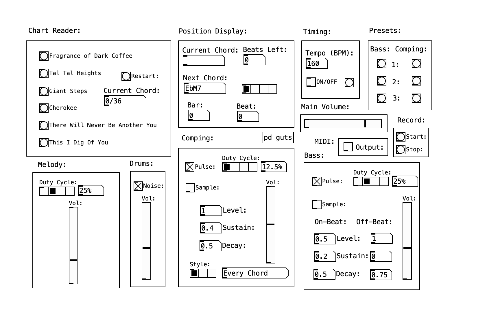

# GameBacking Generator
 PureData patch for algorithmically generating Game Boy style jazz backing tracks

  

# Overview:
 GameBacking Generator is a simple jazz backing track consisting of percussion, bass, and harmony (comping) based on chord changes supplied through a text file. The sound is intended to emulate that of the original Game Boy, featuring pulse waves with adjustable duty cycles and a noise channel for the percussion. Optionally, this patch can also take samples for the comping or bass sounds instead of the pulse waves. In addition, there is support for MIDI input to play a monophonic melody line alongside the generated backing track. Rudimentary recording is implemented with writesf2~ to export .wav files of the generated backing tracks.

[Here](https://soundcloud.com/theflyingmanta/mibop) is a track I made utilizing the patch!

# Use:
 To test out the patch, open the project with the main.pd file. 

# Chord Formatting:
 Chords are supplied in the format of "Root Quality Duration", featuring one chord per line in a simple text file (see example chord sheets). Chords are read in the assumption of 4/4 time. Qualities that can be processed include: 
 - M7: Major 7th
 - '7: Dominant 7th
 - m7: Minor 7th
 - m7b5: Minor 7th Flat 5 (Half-Diminished)
 - dim7: Diminished 7th
 - aug7: Augmented 7th
 - '6: 6th
 
 Durations are then input as an integer representing how many beats that chord will stay for. (e.g. Ab Major 7th for 4 beats would be represented as "Ab M7 4")
 Once a custom chord sheet has been created, simply add it to the /charts/ subdirectory, and add a message with the filename into the "input-reader" subpatch to the main trigger.

# Sample Formatting:
 Samples are added into the /samples/ subdirectory. Formatting is optional, but to load the samples properly you must edit the read objects in the "loading-samples" subpatch under "pd guts". Do not forget to edit the reference pitch either!

 # Recording & MIDI:
  Recording generated backing tracks is possible in two ways: directly as a .wav file and indirectly through MIDI output. 
  
  The "Record" section of the main program will start recording all output audio on press of start, and end recording on stop. The .wav file is written directly as a "rec.wav" file in the main directory, so please copy them out or rename them if you plan on recording multiple times.
  The "MIDI" section will instead output the bass and comping parts as MIDI output on two different channels (default 1 for bass and 2 for comping). Setting the output MIDI device to a bus (such as IAC Driver on Mac), will allow you to record and manipulate the MIDI data in an external DAW. As the MIDI output will not have the ADSR features of the program's audio output, it instead cuts off note input signals after 90% of the note duration for bass, and 99% for comping. These values are adjustable from the midi-out subpatch.
